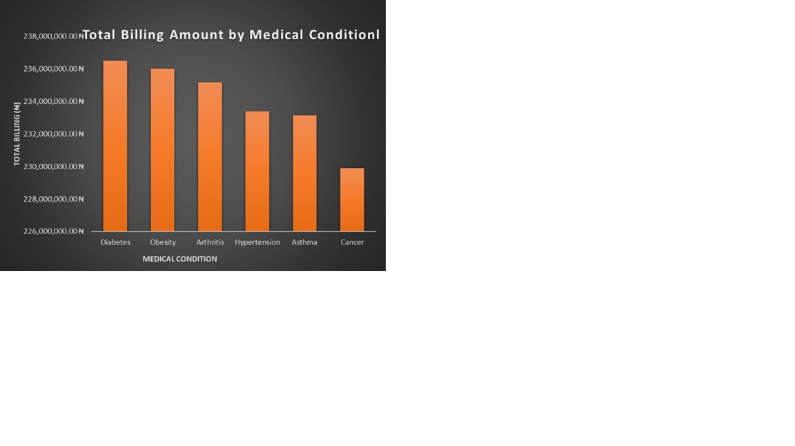
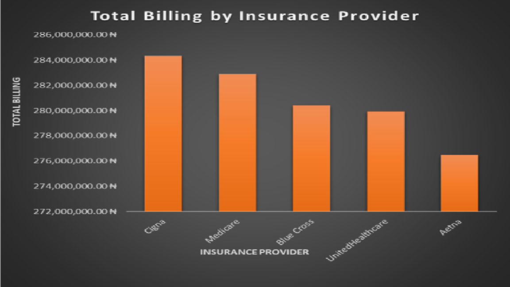
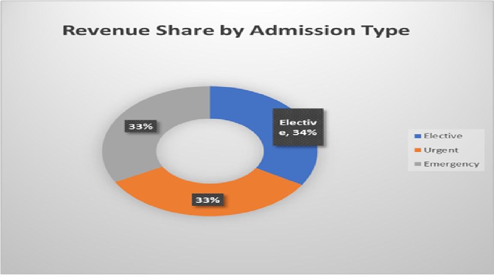
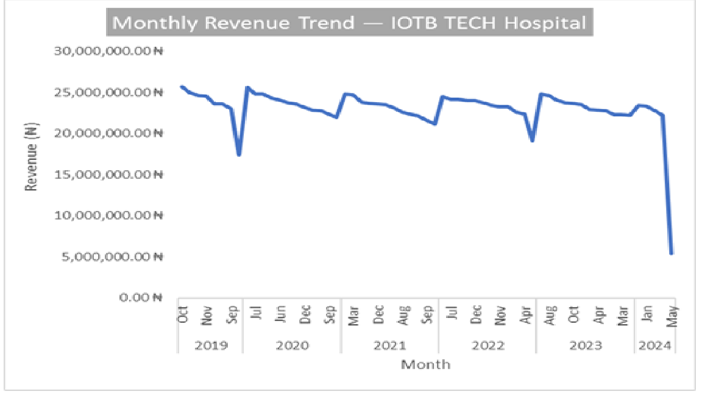
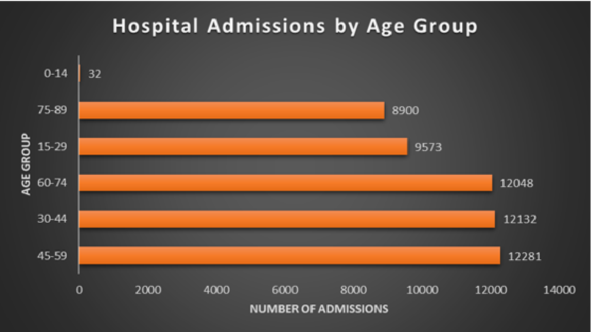
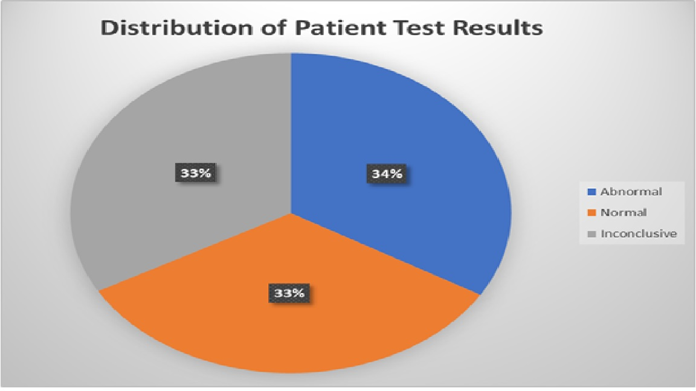
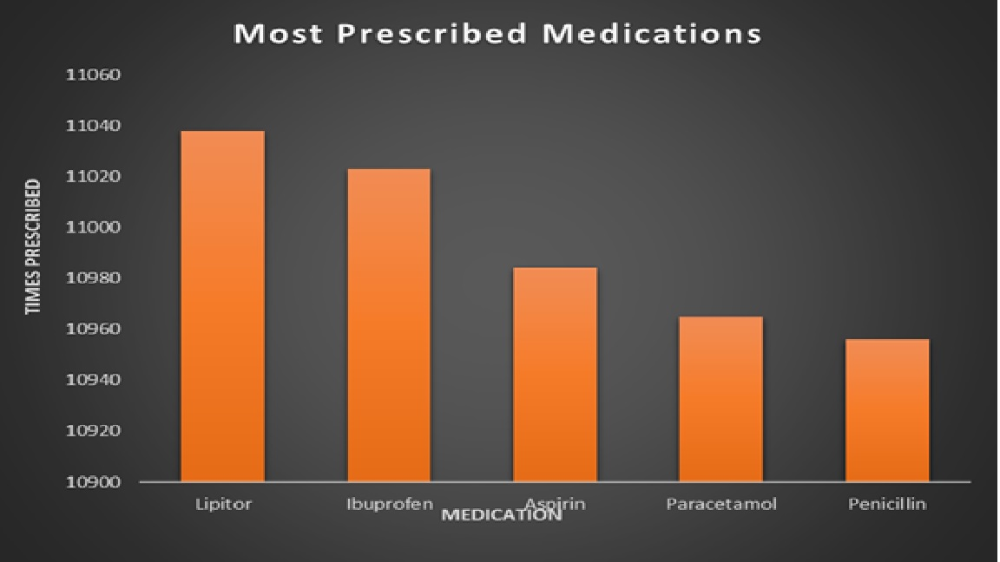
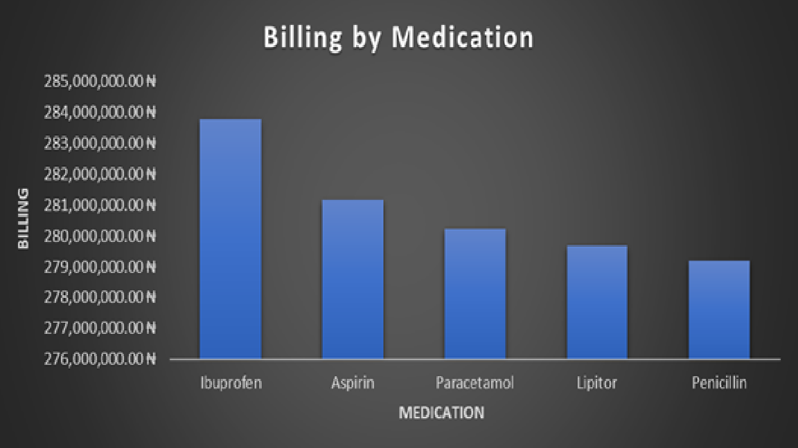

# IOTB TECH Hospital — Healthcare Data Analysis Report
## Prepared by: Nafeesah Siraj | Dataset: 54,966 Patient Records

## Executive Summary

This analysis evaluates admission patterns, billing trends, medication utilization, payer distribution, laboratory outcomes, and length of stay across the IOTB TECH Hospital dataset. The findings suggest a substantial chronic disease burden driven primarily by diabetes, arthritis, hypertension, obesity, and associated cardiovascular risk factors. Several operational patterns, including prolonged asthma admissions, high abnormal laboratory rates, and strong elective admission revenue performance, have implications for clinical efficiency, resource allocation, and long-term hospital strategy.

---

## Key Findings at a Glance

| Metric | Finding |
|---|---|
| Total Patient Records | 54,966 |
| Total Hospital Revenue | ₦1,404,068,339.23 |
| Most Common Condition | Arthritis (9,218 patients) |
| Highest Revenue Condition | Diabetes (₦236,486,971.10) |
| Top Insurance Provider | Cigna (₦284,334,099.18) |
| Highest Revenue Admission Type | Elective (₦473,133,056.18) |
| Busiest Age Group | 45–59 years (12,281 patients) |
| Busiest Month | August 2020 (1,003 admissions) |
| Most Prescribed Medication | Lipitor (11,038 prescriptions) |
| Total Abnormal Test Results | 18,437 |
| Condition with Most Abnormal Results | Arthritis (3,156 cases) |
| Gender with Most Emergency Admissions | Female (9,166) |

---

## Insight 1 — Diabetes Generates the Highest Revenue Burden Per Patient

Diabetes generated the highest total billing revenue at ₦236,487,000 despite having nearly the same patient volume as arthritis (9,216 versus 9,218 patients). This suggests that diabetic admissions require more resource-intensive management per patient rather than simply reflecting higher patient numbers.

One possible explanation is that diabetic patients often require multidisciplinary management involving laboratory monitoring, medication adjustment, specialist consultations, and treatment of complications such as renal impairment or vascular disease. While the dataset does not include severity indicators or complication rates, the elevated revenue associated with diabetes may indicate a comparatively higher intensity of care per admission.

The revenue gap between diabetes and cancer is particularly noteworthy. Cancer recorded the lowest total billing at ₦229,892,000, despite being a condition typically associated with expensive treatment modalities such as chemotherapy, surgical oncology, and radiation therapy. This may suggest that cancer patients in this dataset are being managed conservatively, referred externally for specialist treatment, or presenting at stages where intensive intervention is not pursued. This pattern warrants further clinical investigation as it may represent either a referral pathway gap or an underutilization of oncology services within the hospital.

From an operational perspective, the hospital may benefit from strengthening structured outpatient diabetic follow-up programs aimed at reducing avoidable acute admissions and improving continuity of care.

---

## Insight 2 — Prolonged Asthma Admissions May Indicate Operational or Clinical Inefficiencies

Asthma recorded the longest average length of stay at 15.7 days. In many healthcare systems, asthma admissions are often associated with shorter inpatient stays when patients respond rapidly to bronchodilator therapy and stabilization protocols. The markedly prolonged stay observed in this dataset may therefore warrant further investigation.

Possible contributing factors may include severe presentation at admission, delayed stabilization, limited respiratory support resources, discharge bottlenecks, or high rates of comorbidity. Because the dataset does not contain severity scores or ICU utilization data, definitive conclusions cannot be made. However, the finding is operationally significant and supports conducting a focused clinical audit of asthma admissions to identify avoidable causes of prolonged hospitalization.

Reducing unnecessary inpatient days could meaningfully improve bed availability and overall patient flow efficiency across the hospital.

---

## Insight 3 — Arthritis Represents a High-Volume, High-Complexity Patient Burden

Arthritis recorded the highest patient volume at 9,218, the highest abnormal test count at 3,156, and the second longest average stay at 15.5 days. This combination suggests that arthritis represents one of the hospital's most resource-intensive chronic disease groups.

The elevated abnormal test frequency may indicate that many patients present with advanced disease activity, associated inflammatory complications, or multiple coexisting conditions. Because arthritis management depends heavily on long-term monitoring and early intervention, the findings support expansion of outpatient rheumatology, physiotherapy, and chronic pain management services.

The concentration of arthritis burden within middle-aged and older adults also aligns with the hospital's broader chronic disease profile centered on the 45–59 age group.

---

## Insight 4 — Payer Revenue Distribution Appears Stable but Moderately Concentrated

Cigna contributed ₦284,334,099, representing approximately 20.2% of total hospital revenue, making it the hospital's largest single payer. Although the revenue difference between Cigna and other providers is not extreme, dependence on any single payer introduces potential financial concentration risk. Delayed reimbursements, contract disputes, or policy changes affecting a major insurer could significantly influence hospital cash flow stability.

The relatively balanced contribution across providers is operationally favorable, but continuous monitoring of reimbursement timelines, denial rates, and payer contract performance would support stronger financial governance and reduce exposure to single-payer risk.

---

## Insight 5 — Elective Admissions Are Financially Efficient Revenue Drivers

Elective admissions generated the highest revenue category at ₦473,133,056, exceeding both urgent admissions at ₦469,238,000 and emergency admissions at ₦461,697,000. However, it is important to note that the margin between all three admission types is relatively narrow at approximately 3% difference between the highest and lowest performing category on a total revenue base of ₦1.4 billion. This suggests the hospital generates broadly consistent revenue across admission types, with elective admissions holding a modest but meaningful advantage in financial efficiency rather than a dominant lead.

This pattern is operationally important because elective admissions are generally planned, resource-coordinated, clinically optimized, and associated with lower disruption to hospital workflow. Emergency admissions by contrast often require rapid resource mobilization and can increase operational strain without a proportional revenue advantage.

The findings suggest that expanding elective service capacity — particularly through specialist outpatient referrals and planned procedural pathways — may support both financial performance and operational efficiency without requiring proportional increases in emergency infrastructure.

---

## Insight 6 — Monthly Revenue Has Been Stable But May 2024 Signals a Critical Disruption
IOTB TECH Hospital maintained a remarkably consistent monthly revenue band of approximately ₦21,000,000 to ₦26,000,000 across the entire period from October 2019 through early 2024. This consistency across nearly five years reflects a stable patient admission volume and a reliable payer mix — a sign of operational maturity and financial predictability that most hospitals strive for.
Three moderate dips are visible within this stable band, in late 2019, mid 2020, and mid 2022. The 2020 dip is particularly noteworthy as it coincides with the global COVID-19 pandemic period, during which hospital revenues worldwide were disrupted by reduced elective admissions, patient avoidance of healthcare facilities, and resource reallocation toward pandemic response. The fact that IOTB TECH recovered quickly from this dip and returned to its normal revenue band within months suggests strong operational resilience.
However May 2024 represents a dramatically different situation. Revenue collapsed to approximately ₦6,000,000, a fall of nearly 75% below the hospital's established monthly baseline. This is not a normal fluctuation. A drop of this magnitude within a single month has no precedent in the preceding five years of data and demands urgent investigation by hospital management.
Possible explanations include incomplete data capture for May 2024, meaning the dataset may not contain all admissions and billing records for that month, which would make the drop a data quality issue rather than a true revenue collapse. Alternatively, if the data is complete, the drop may reflect a genuine operational crisis such as a sudden reduction in admissions, a major payer reimbursement failure, a facility disruption, or an external event affecting patient access. A Medical Director and CFO should treat this figure as a red flag requiring immediate root cause analysis before any strategic decisions are made based on 2024 financial projections.

---

## Insight 7 — Five Years of Flat Revenue Signals Real Financial Decline
One of the most strategically significant findings hidden in the monthly revenue trend is not a single month's performance but the overall trajectory across the entire dataset period. From late 2019 through 2023, IOTB TECH Hospital's monthly revenue remained essentially flat, consistently oscillating between ₦21,000,000 and ₦26,000,000 without any meaningful upward growth trend.
On the surface this may appear to represent stability. In reality, flat nominal revenue over a five year period that included significant inflation, particularly in Nigeria where inflation has risen substantially since 2019, means the hospital's real purchasing power has declined considerably. The same ₦23,000,000 that bought medical supplies, paid staff, and covered operational costs in 2019 buys meaningfully less of all those things in 2023. The hospital is effectively running harder just to stay in the same place.
For a growing institution serving over 54,000 patients across multiple chronic disease categories, stagnant revenue is a warning sign. It may indicate that billing rates have not been updated to reflect rising operational costs, that insurance reimbursement rates have not been renegotiated in several years, or that patient volume growth has plateaued. Hospital management should conduct a comprehensive revenue cycle review, examining billing rates, insurance contract terms, and service pricing, to identify where revenue growth opportunities exist and implement a structured plan to achieve meaningful year-on-year revenue increases going forward.

---

## Insight 8 — Adults Aged 45–59 Represent the Hospital's Core Chronic Disease Population

The 45–59 age group recorded the highest admission volume at 12,281 patients. This age range commonly corresponds with increased prevalence of diabetes, hypertension, obesity, arthritis, and cardiovascular risk factors. The concentration of admissions within this demographic suggests that the hospital's operational burden is strongly driven by chronic multi-condition disease management rather than isolated acute illness.

This finding supports investment in integrated chronic disease management pathways focused on middle-aged adults, including coordinated multidisciplinary outpatient care that addresses comorbidities simultaneously rather than treating each condition in isolation.

---

## Insight 9 — High Abnormal Test Rates Suggest a Clinically High-Risk Patient Population

Abnormal laboratory results at 18,437 slightly exceeded normal results at 18,331 within the dataset, meaning more patients presented with clinically concerning test outcomes than normal ones. This is an operationally significant finding that suggests a large proportion of patients may be presenting with active or uncontrolled disease processes requiring ongoing clinical management.

Arthritis alone accounts for 3,156 of the 18,437 abnormal results at approximately 17.1% of all abnormal outcomes from a condition representing only 16.8% of patients. This slight overrepresentation suggests arthritis patients generate disproportionately abnormal clinical findings relative to their share of the patient population, further reinforcing the need for earlier intervention and more structured outpatient monitoring for this condition.

This finding has broader implications for specialist staffing needs, diagnostic workload, follow-up coordination, and laboratory resource utilization across the hospital.

---

## Insight 10 — Female Emergency Admissions May Reflect Delayed Access to Preventive Care

Female patients recorded 9,166 emergency admissions compared with 8,936 among males. While the numerical difference is modest, emergency admissions are typically associated with higher clinical acuity and greater resource utilization than elective or urgent admissions.

It is important to note that female emergency admissions represent a structurally broader and more heterogeneous category than the defined disease groups in this dataset. They encompass a mixture of obstetric emergencies such as labour complications and postpartum haemorrhage, gynaecological emergencies including ectopic pregnancy and acute pelvic conditions, and non-obstetric cases such as trauma and accidents. This means the female emergency figure reflects overall emergency utilization among women rather than the prevalence of any single clinical condition, which limits direct comparison with the individual disease categories analysed elsewhere in this report.

With that structural consideration in mind, the pattern may still reflect underlying issues such as delayed healthcare access, lower preventive care utilization, or sex-specific disease burden differences within the catchment population. Because the dataset lacks socioeconomic, obstetric, and diagnostic detail, causal interpretation remains limited. However, the finding justifies further investigation into barriers affecting timely healthcare utilization among female patients, and supports the development of targeted community outreach programs covering both women's preventive health and maternal and gynaecological emergency preparedness.

---

## Insight 11 — Lipitor Utilization Suggests a Significant Underlying Cardiovascular Risk Burden

Lipitor (atorvastatin) was prescribed 11,038 times, making it the most frequently prescribed medication in the dataset by a meaningful margin over the second most prescribed medication Ibuprofen at 11,023 prescriptions. Since atorvastatin is commonly used for cholesterol management and cardiovascular risk reduction, its high utilization may indicate substantial underlying cardiovascular risk across the patient population, particularly among patients with diabetes, hypertension, and obesity, all of which are strongly represented in this dataset.

Although cardiovascular disease was not listed as a primary diagnosis category, the prescribing pattern suggests that cardiovascular risk management represents an important and currently invisible secondary clinical burden. Additional analysis linking medication utilization to individual diagnosis categories would help clarify the true extent of cardiovascular comorbidity and may reveal that the hospital is managing a significantly higher cardiac risk population than the primary diagnosis data alone suggests.

---

## Insight 12 — Ibuprofen Edges Lipitor in Total Revenue Despite Lower Prescription Volume
Lipitor leads all medications in prescription volume at 11,038, with Ibuprofen ranking second. Yet despite being prescribed less frequently, Ibuprofen generates approximately ₦2,621,583 more in total billing than Lipitor, making it the highest revenue-generating medication in the dataset by a narrow but meaningful margin.
The fact that a less prescribed medication outbills the most prescribed one, even modestly, reveals an important difference in the cost profile of each treatment episode. Lipitor as a cholesterol management medication is typically straightforward to administer, a daily oral tablet requiring minimal additional monitoring or intervention per prescription cycle. Ibuprofen in a hospital inpatient setting however is more likely to be used at higher doses, over longer treatment durations, and in the context of inflammatory conditions such as arthritis which frequently require additional supportive care, monitoring, and specialist input. These factors collectively drive a higher billing amount per episode despite lower overall prescription frequency.
While the revenue gap of approximately ₦2,621,583 is not dramatic, the principle it reveals is significant. Prescription volume alone is not a reliable indicator of financial contribution. 

## Recommendations Summary

1. Strengthen outpatient diabetes management programs to reduce avoidable acute admissions and improve continuity of care across the hospital's highest-revenue condition.
2. Conduct a focused clinical audit of asthma admissions to identify factors contributing to a 15.7 day average stay that significantly exceeds international benchmarks.
3. Investigate the low cancer billing relative to other conditions. Determine whether oncology patients are being referred externally and whether internal oncology capacity should be expanded.
4. Expand outpatient arthritis management services including physiotherapy, chronic pain support, and early intervention pathways to reduce severity of presentation and average length of stay.
5. Monitor payer concentration risk through ongoing review of reimbursement performance, denial rates, and insurer contract terms across all five providers.
6. Continue strategic expansion of elective admission services given their operational efficiency and revenue performance advantage over emergency admissions.
7. Develop integrated chronic disease management pathways specifically targeting adults aged 45–59 — the hospital's highest-volume and most complex patient demographic.
8. Investigate drivers of high abnormal laboratory result rates through disease-specific laboratory analysis, with particular focus on arthritis given its disproportionate abnormal result burden.
9. Explore preventive care utilization patterns among female patients and implement community health outreach programs to reduce emergency admission rates in this group.
10. Conduct diagnosis-medication linkage analysis to quantify the true cardiovascular comorbidity burden across the patient population and determine whether a dedicated cardiovascular risk management program is warranted.
11. Include formal data quality validation procedures in future analyses given the unusually balanced disease distribution observed across all six condition categories.
12. Conduct a comprehensive revenue cycle review examining billing rates, insurance contract terms, and service pricing. Meaningful year-on-year revenue growth targets should be established to ensure the hospital's financial performance keeps pace with inflation and rising operational costs
---

## Limitations of the Analysis

Several limitations should be considered when interpreting these findings. The dataset contains no  mortality, ICU, readmission, or disease severity indicators were available for analysis. Medication prescriptions could not be directly linked to individual diagnoses within the dataset structure. The dataset does not include outpatient follow-up or long-term patient outcomes. Socioeconomic and behavioral health variables were unavailable, limiting interpretation of healthcare access and disease management patterns. The presence of 108 negative billing amount records may marginally affect revenue totals and should be interpreted with caution in financial analyses.

As a result, the findings should be interpreted primarily as operational and exploratory insights rather than definitive clinical conclusions. Future analyses incorporating severity scoring, diagnosis-medication linkage, and longitudinal follow-up data would substantially strengthen the depth and clinical applicability of these findings.

---

*This report was prepared based on analysis of 54,966 patient records from the IOTB TECH Hospital healthcare dataset following removal of 534 duplicate records. All figures are derived from pivot table analysis conducted in Microsoft Excel.*

---
